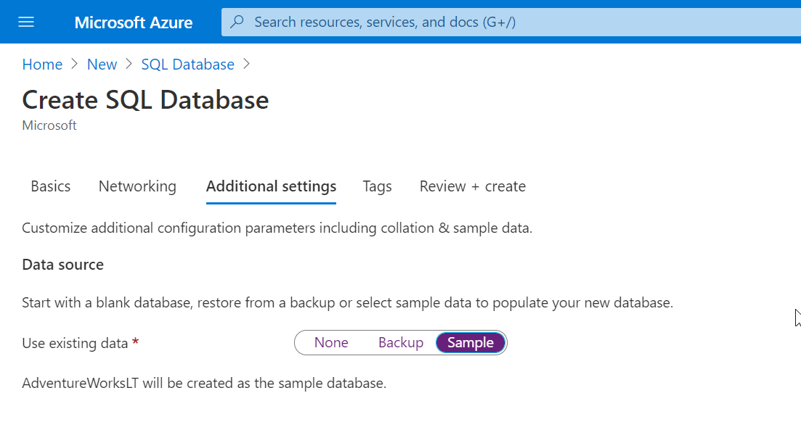
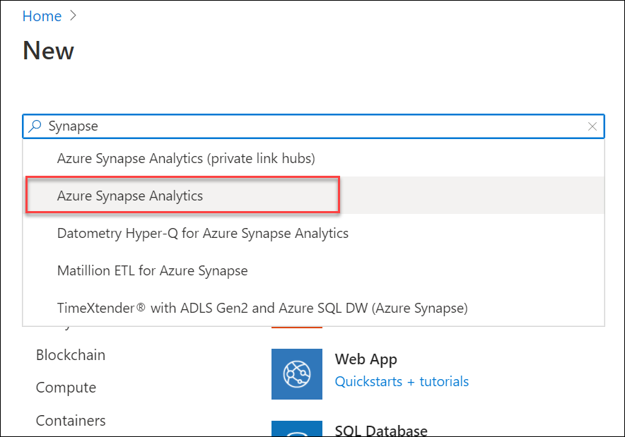
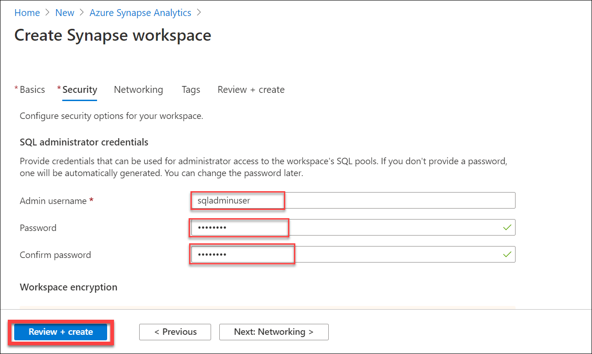
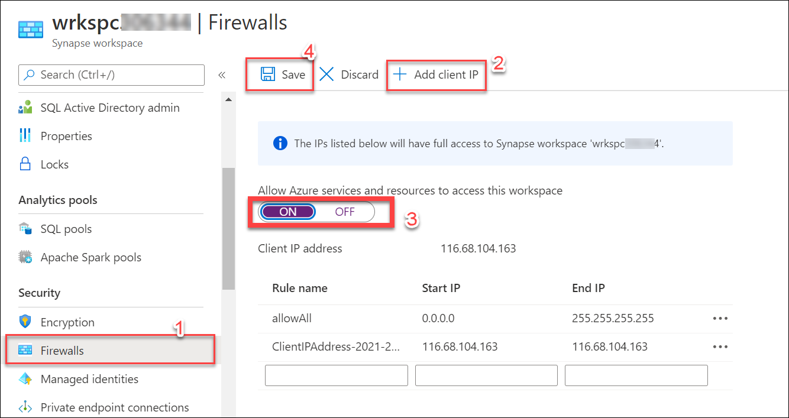

# DP 200 - Implementing a Data Platform Solution
# Lab 4 - Working with Relational Data Stores in the Cloud

**Estimated Time**: 75 minutes

**Lab files**: The files for this lab are located in the _C:\AllFiles\DP-200-Implementing-an-Azure-Data-Solution-master\Labfiles\Starter\DP-200.5_ folder.

## Lab overview

The students will be able to provision an Azure SQL Database and Azure Synapse Analytics server and be able to issue queries against one of the instances that are created. They will be also be able to integrate a data warehouse with a number of other data platform technologies and use PolyBase to load data from one data source into Azure Synapse Analytics.

## Lab objectives
  
After completing this lab, you will be able to:

1. Use Azure SQL Database
1. Describe Azure Synapse Analytics 
1. Create and query Azure Synapse Analytics 
1. Use PolyBase to load data into Azure Synapse Analytics 

## Scenario
  
You are the senior data engineer at AdventureWorks, and you are working with your team to transition a relational database system from an on-premises SQL Server to a Azure SQL Database located in Azure. You will begin by creating an instance of Azure SQL Database with the company's sample database. Your intention is to hand this instance of to a junior data engineer to perform some testing of departmental databases.

You will then provision Azure Synapse Analytics server and test that the provisioning of the server is successful by testing a sample database with a series of queries. You will then use PolyBase to load a dimension table from Azure Blob to test that the integration of this data platform technology with Azure Synapse Analytics.

At the end of this lab, you will have:

1. Used Azure SQL Database
1. Described Azure Synapse Analytics 
1. Created and queried Azure Synapse Analytics 
1. Used PolyBase to doad data into Azure Synapse Analytics 

> **IMPORTANT**: As you go through this lab, make a note of any issue(s) that you have encountered in any provisioning or configuration tasks and log it in the table in the document located at _C:\AllFiles\DP-200-Implementing-an-Azure-Data-Solution-master\Labfiles\DP-200-Issues-Doc.docx_. Document the Lab number, note the technology, Describe the issue, and what was the resolution. Save this document as you will refer back to it in a later module.

## Exercise 1: Use Azure SQL Database

Estimated Time: 15 minutes

Individual exercise
  
The main task for this exercise are as follows:

1. Create and configure a SQL Database instance.

### Task 1: Create and configure a SQL Database instance.

1. Before starting just to familiarize, we will be using deployment id for naming convention where xxxxxx will be asked to replace with deployment id and it can be found from the environment details tab from the right side of your environment.

    

1. In the Azure portal, navigate to the **+ Create a resource** blade.

1. In the New screen, click the **Search the Marketplace** text box, and type the word **SQL Database**. Click **SQL Database** in the list that appears.

    

1. In the **SQL Database** screen, click **Create**.

1. From the **Create SQL Database** screen, create an Azure SQL Database with the following settings:

    - In the Project details section, type in the following information
    
        - **Subscription**: the name of the subscription you are using in this lab

        - **Resource group**: select existing resource group with name **awrgstud-DeploymentId**.

    - Click on the  **Additional setting** tab, click **Sample** . The AdventureworksLT sample database is selected automatically.
    
        
    
    - Click the **Basics** tab once this has been done.
    
    - In the Database details section, type in the following information
    
        - Database name: type in **AdventureworksLT**
     
        - Server: Create a new server by clicking **Create new** with the following settings and click on **OK**:
            - **Server name**: **sqlservice-xxxxx**, where **xxxxxx** is the deploymentId and you can find it from the environment details tab.
            - **Server admin login**: **sqladmin**
            - **Password**: **Pa55w.rd**
            - **Confirm Password**: **Pa55w.rd**
            - **Location**: choose a **location** near to you.
            - click on **OK**
            - Leave the remaining settings to their defaults, and then click on **OK**

    

1. In the **Create SQL Database** blade, click **Review + create**.

1. After the validation of the **Create SQL Database** blade, click **Create**.

   > **Note**: The provision will takes approximately 4 minutes.

> **Result**: After you completed this exercise, you have an Azure SQL Database instance

## Exercise 2: Describe Azure Synapse Analytics
  
Estimated Time: 15 minutes

Individual exercise
  
The main tasks for this exercise are as follows:

1. Create and configure a Azure Synapse Analytics instance.

2. Configure the Server Firewall

3. Pause the warehouse database

### Task 1: Create and configure a Azure Synapse Analytics instance.

1. In the Azure portal, click on the link **home** at the top left of the screen.

2. In the Azure portal, click **+ Create a resource**.

3. In the New blade, navigate to the **Search the Marketplace** text box, and type the word **Synapse**. Click **Azure Synapse Analytics** in the list that appears.

    

4. In the **Azure Synapse Analytics** blade, click **Create**.

5. From the **Create Synapse workspace** **basics** blade, create an Azure Synapse Analytics Workspace with the following settings:

    - In the Project details section, type in the following information

        - **Subscription**: the name of the subscription you are using in this lab

        - **Resource group**: **awrgstud-xxxxxx**, where **xxxxxx** is the deploymentId and you can find it from the environment details tab.

    - In the workspace details section, create the workspace with the following settings:
        
        - **Workspace Name**: **wrkspcxxxxxx**, where **xxxxxx** is the deploymentId and you can find it from the environment details tab.
        - **Region**: choose the region nearest to you and where you deployed your resource group
        - **Select Data Lake Storage Gen2**: "from subscription"
        - **Account Name**: select **awdlsstudxxxxxx**, where **xxxxxx** is the deploymentId and you can find it from the environment details tab.
        - **File System Name**: select **data**
        - **Check** the "Assign myself the Storage Blob Data Contributor role on the Data Lake Storage Gen2 account 'awdlsstudxxxxxx" 

         

    - Navigate to the **Security** tab in the **Create Synapse workspace** blade. 

    - Under the SQL administrator credentials section provide the following:
        - **Password**: **Pa55w.rd**
        - **Confirm Password**: **Pa55w.rd**
        - Leave all the other settings as **default**. 

    
    - In the screen, click **Review + create**.
    - In the blade, click **Create**.

   > **Note**: The provision will takes approximately 7 minutes.

6. Once provisioned select **Go to resource group**, and find and click your Azure Synapse Analytics workspace with name **wrkspcxxxxxx**.

7. Select **+ New dedicated SQL Pool**.

8.. In the **basics** page of **Create dedicated SQL pool** blade configure the following settings:
        - Dedicated SQL pool name: **dedsqlxxxxxx**, where **xxxxxx** is the deploymentId and you can find it from the environment details tab.
        - Leave all the other settings per default

9. In the **Create dedicated SQL pool** screen, click **Review + create**.

10. In the **Create dedicated SQL pool** blade, click **Create**.
  

   > **Note**: The provision will takes approximately 7 minutes.

### Task 2: Configure the Server Firewall

1. In the Azure portal, in the blade, click **Resource groups**, and then click **awrgstud-xxxxxx**, and then click on **wrkspcxxxxxx**, where **xxxxxx** is the deploymentId and you can find it from the environment details tab.

2. In the **wrkspcxxxxxx** screen, click on **Firewalls**.

3. In the **wrkspcxxxxxx**- Firewalls  screen, click on the option **+ Add client IP**, and check that **Allow Azure services and resources to access this workspace** is set to **On**, and then click on **Save**. On the success screen click **OK**.

    

    > **Note**: You will receive a message stating that the the server firewall rules have been successfully updated

4. Close down the Firewalls screen.

> **Result**: After you completed this exercise, you have created an Azure  Synapse Analytics  instance and configures the server firewall to enable connections against it.

### Task 3: Pause the **dedsqlxx** dedicated SQL Pool

1. Navigate to resource group **awrgstud-xxxxxx**. 

2. Click on **dedsqlkxxxxxx (wrkspcxxxxxx/dedsqlxxxxxx)**, where **xxxxxx** is the deploymentId and you can find it from the environment details tab.

3. In the **dedsqlkxxxxxx (wrkspcxxxxxx/dedsqlxxxxxx)** screen, click on **Pause**.

4. In the Pause **dedsqlxxxxxx** screen, click **Yes**


## Exercise 3: Creating an Azure Synapse Analytics database and tables

Estimated Time: 25 minutes

Individual exercise

The main tasks for this exercise are as follows:

1. Understand Synapse Studio and connect to a dedicated SQL Pool.

2. Create a dedicated SQL Pool database

3. Create dedicated SQL Pool tables

    > **Note**: If you are not familiar with Transact-SQL, statements are available for the following labs in the following location **C:\AllFiles\DP-200-Implementing-an-Azure-Data-Solution-master\Labfiles\Starter\DP-200.5\SQL DW Files**

### Task 1: Connect the Dedicated SQL Pool to Azure Synapse Studio

1. Navigate to the **dedsqlxxxxxx** resource in your resource group **awrgstud-xxxxxx** . 

2. In the **overview** section of the Synapse Workspace navigate to **Open Synapse Studio**

3. Click on the **Manage Hub** on the left side of the screen

4. Select **SQL pool** and select **+ New**

    - In the Basics details section, type in the following information

        - **Dedicated SQL pool name**: **DWDB**

    - Leave all the other settings as default

    - Select **Review + Create** and select **Create**


    

 > **Note**: The creation of the database takes approximately 6 minutes.

5. Once the database is set up, navigate to the **Data Hub** on the left side of the screen. Select the ellipsis next to **Databases** and select **refresh**. You should see the the newly created database DWDB. 


### Task 3: Create dedicated SQL Pool tables.

1. In Synapse Studio, navigate to the newly created database under **Databases** in the **Data hub**, when opening the ellipsis in the **Data hub** tab. Click on **DWDB**.

2. Select the ellipsis next to the **DWDB** database.

3. Select **New SQL script**, and **empty script**

    >**Note**: If you are unfamiliar with Transact-SQL, there is a script in the Allfiles\Solution\DP-200.5\folder named **Exercise3 Task3Step2 script.sql**. It contains the bulk of the code required to create the tables, but you do have to complete the code by selecting the distribution type to use for each table 

4. Create a table named **dbo.Users** with a **clustered columnstore** index with a distribution of **replicate** with the following columns:

    | column name | data type | Nullability|
    |-------------|-----------|------------|
    | userId | int | NULL|
    | City | nvarchar(100) | NULL|
    | Region | nvarchar(100) | NULL|
    | Country | nvarchar(100) | NULL|

      >**Note**: Make sure that the script has is connected to **DWDB** and uses the database **DWDB**. 


5. In **Synapse Studio**, click on **Run** and the query will be executed. To verify if the **dbo.Users** table was created you can click refresh and navigate to **tables** which, when expanded, should show you the table. 

6. In Synapse Studio, navigate to the newly created database under **Databases** , when opening the ellipsis in the **Data hub** tab. Click on **DWDB**.

7. Select the ellipsis next to the **DWDB** database.

8. Select **New SQL script**, and **empty script**

9. Create a table named **dbo.Products** with a **clustered columnstore** index with a distribution of **round robin** with the following columns:

    | column name | data type | Nullability|
    |-------------|-----------|------------|
    | ProductId | int | NULL|
    | EnglishProductName | nvarchar(100) | NULL|
    | Color | nvarchar(100) | NULL|
    | StandardCost | int | NULL|
    | ListPrice | int | NULL|
    | Size | nvarchar(100) | NULL|
    | Weight | int | NULL|
    | DaysToManufacture | int | NULL|
    | Class | nvarchar(100) | NULL|
    | Style | nvarchar(100) | NULL|

    >**Note**: Make sure that the script has is connected to **DWDB** and uses the database **DWDB**. 

10. In **Synapse Studio**, click on **Run** and the query will be executed. To verify if the **dbo.Products** table was created you can click refresh and navigate to **tables** which, when expanded, should show you the table. 

11. In Synapse Studio, navigate to the newly created database under **Databases** , when opening the ellipsis in the **Data hub** tab. Click on **DWDB**.

12. Select the ellipsis next to the **DWDB** database.

13. Select **New SQL script**, and **empty script**

14. Create a table named **dbo.FactSales** with a **clustered columnstore** index with a distribution of **Hash** on the **SalesUnit** with the following columns:

    | column name | data type | Nullability|
    |-------------|-----------|------------|
    | DateId | int | NULL|
    | ProductId | int | NULL|
    | UserId | int | NULL|
    | UserPreferenceId | int | NULL|
    | SalesUnit | int | NULL|

    >**Note**: Make sure that the script has is connected to **DWDB** and uses the database **DWDB**. 

15. In **Synapse Studio**, click on **Run** and the query will be executed. To verify if the **dbo.FactSales** table was created you can click refresh and navigate to **tables** which, when expanded, should show you the table. 

> **Result**: After you completed this exercise, you have used Synapse Studio to create a data warehouse named DWDB and three tables named Users, Products and FactSales.

## Exercise 4: Using PolyBase to Load Data into Azure Synapse Analytics 

Estimated Time: 10 minutes

Individual exercise

The main tasks for this exercise are as follows:

1. Collect Data Lake Storage container and key details

2. Create a dbo.Dates table using PolyBase from Azure Data Lake Storage

### Task 1: Collect Azure Blob account name and key details

1. In the Azure portal, click on **Resource groups** and then click on **awrgstudxxxxxx**, and then click on **awdlsstudxxxxxx** where **xxxxxx** is the deploymentId and you can find it from the environment details tab.

2. In the **awdlsstudxxxxxx** screen, click **Access keys**. Click on the icon next to the **Storage account name** and paste it into Notepad.

3. In the **awdlsstudxxxxxx - Access keys** screen, under **key1**, Click on the icon next to the **Key** and paste it into Notepad.

### Task 2: Create a dbo.Dates table using PolyBase from Azure Blob

1. In Synapse Studio, navigate to the newly created database under **Databases** , when opening the ellipsis in the **Data hub** tab. Click on **DWDB**.

2. Select the ellipsis next to the **DWDB** database.

3. Select **New SQL script**, and **empty script**

4. Create a **master key** against the **DWDB** database. In the query editor, type in the following code:

    ```SQL
    CREATE MASTER KEY;
    ```
    >**Note**: Make sure that the script has is connected to **DWDB** and uses the database **DWDB**. 

5. In **Synapse Studio**, click on **Run** and the query will be executed.

6. In Synapse Studio, navigate to the newly created database under **Databases** , when opening the ellipsis in the **Data hub** tab. Click on **DWDB**.

7. Select the ellipsis next to the **DWDB** database.

8. Select **New SQL script**, and **empty script**

9. Create a database scoped credential named **AzureStorageCredential** with the following details, by typing in the following code in the query editor:
    - IDENTITY: **MOCID**
    - SECRET: **The access key of your storage account**

    ```SQL
    CREATE DATABASE SCOPED CREDENTIAL AzureStorageCredential
    WITH
    IDENTITY = 'MOCID',
    SECRET = 'Your storage account key'
;
    ```
    >**Note**: Make sure that the script has is connected to **DWDB** and uses the database **DWDB**. 

10. In **Synapse Studio**, click on **Run** and the query will be executed.

11. In Synapse Studio, navigate to the newly created database under **Databases** , when opening the ellipsis in the **Data hub** tab. Click on **DWDB**.

12. Select the ellipsis next to the **DWDB** database.

13. Select **New SQL script**, and **empty script**

14. In the Query window, type in code that will create an external data source named **AzureStorage** for the Blob storage account and data container created in with a type of **HADOOP** that makes use of the ****AzureStorageCredential**. Note that you should replace **awdlsstudxxxxxx** in the location key with your storage account with your deploymentID

    ```SQL
	CREATE EXTERNAL DATA SOURCE AzureStorage
    WITH (
        TYPE = HADOOP,
        LOCATION = 'abfs://data@awdlsstudxxxxxx.dfs.core.windows.net',
        CREDENTIAL = AzureStorageCredential
    );
    ```
    >**Note**: Make sure that the script has is connected to **DWDB** and uses the database **DWDB**. 

15. In **Synapse Studio**, click on **Run** and the query will be executed.

16. In Synapse Studio, navigate to the newly created database under **Databases** , when opening the ellipsis in the **Data hub** tab. Click on **DWDB**.

17. Select the ellipsis next to the **DWDB** database.

18. Select **New SQL script**, and **empty script**

19. In the Query window, type in code that will create an external file format named **TextFile** with a formattype of **DelimitedText** and a filed terminator of **comma**.

    ```SQL
    CREATE EXTERNAL FILE FORMAT TextFile
    WITH (
        FORMAT_TYPE = DelimitedText,
        FORMAT_OPTIONS (FIELD_TERMINATOR = ',')
    );
    ```
    >**Note**: Make sure that the script has is connected to **DWDB** and uses the database **DWDB**. 

20. In **Synapse Studio**, click on **Run** and the query will be executed.

21. . In Synapse Studio, navigate to the newly created database under **Databases** , when opening the ellipsis in the **Data hub** tab. Click on **DWDB**.

22. Select the ellipsis next to the **DWDB** database.

23. Select **New SQL script**, and **empty script**   

24. In  the Query window, type in code that will create an external table named **dbo.DimDate2External** with the **location** as the root file, the Data source as **AzureStorage**, the File_format of **TextFile** with the following columns:

    | column name | data type | Nullability|
    |-------------|-----------|------------|
    | Date | datetime2(3) | NULL|
    | DateKey | decimal(38, 0) | NULL|
    | MonthKey | decimal(38, 0) | NULL|
    | Month | nvarchar(100) | NULL|
    | Quarter | nvarchar(100) | NULL|
    | Year | decimal(38, 0) | NULL|
    | Year-Quarter | nvarchar(100) | NULL|
    | Year-Month | nvarchar(100) | NULL|
    | Year-MonthKey | nvarchar(100) | NULL|
    | WeekDayKey| decimal(38, 0) | NULL|
    | WeekDay| nvarchar(100) | NULL|
    | Day Of Month| decimal(38, 0) | NULL|

    ```SQL
	CREATE EXTERNAL TABLE dbo.DimDate2External (
    [Date] datetime2(3) NULL,
    [DateKey] decimal(38, 0) NULL,
    [MonthKey] decimal(38, 0) NULL,
    [Month] nvarchar(100) NULL,
    [Quarter] nvarchar(100) NULL,
    [Year] decimal(38, 0) NULL,
    [Year-Quarter] nvarchar(100) NULL,
    [Year-Month] nvarchar(100) NULL,
    [Year-MonthKey] nvarchar(100) NULL,
    [WeekDayKey] decimal(38, 0) NULL,
    [WeekDay] nvarchar(100) NULL,
    [Day Of Month] decimal(38, 0) NULL
    )
    WITH (
        LOCATION='/DimDate2.txt',
        DATA_SOURCE=AzureStorage,
        FILE_FORMAT=TextFile
    );
    ```
    >**Note**: Make sure that the script has is connected to **DWDB** and uses the database **DWDB**. 


25. In **Synapse Studio**, click on **Run** and the query will be executed.

26. In Synapse Studio, navigate to the newly created database under **Databases** , when opening the ellipsis in the **Data hub** tab. Click on **DWDB**.

27. Select the ellipsis next to the **DWDB** database.

28. Select **New SQL script**, and **empty script**  

29. Test that the table is created by running a select statement against it:

    ```SQL
    SELECT * FROM dbo.DimDate2External;
    ```
>**Note**: Make sure that the script has is connected to **DWDB** and uses the database **DWDB**. 


30. In **Synapse Studio**, click on **Run** and the query will be executed.

31. In Synapse Studio, navigate to the newly created database under **Databases** , when opening the ellipsis in the **Data hub** tab. Click on **DWDB**.

32. Select the ellipsis next to the **DWDB** database.

33. Select **New SQL script**, and **empty script**  

34. In the Query window, type in a **CTAS** statement that creates a table named **dbo.Dates** with a **columnstore** index and a **distribution** of **round robin** that loads data from the **dbo.DimDate2External** table.

    ```SQL
    CREATE TABLE dbo.Dates
    WITH
    (   
        CLUSTERED COLUMNSTORE INDEX,
        DISTRIBUTION = ROUND_ROBIN
    )
    AS
    SELECT * FROM [dbo].[DimDate2External];
    ```
>**Note**: Make sure that the script has is connected to **DWDB** and uses the database **DWDB**. 

35. In **Synapse Studio**, click on **Run** and the query will be executed.

36. In Synapse Studio, navigate to the newly created database under **Databases** , when opening the ellipsis in the **Data hub** tab. Click on **DWDB**.

37. Select the ellipsis next to the **DWDB** database.

38. Select **New SQL script**, and **empty script**  
 
39. In the Query window, type in a query that creates statistics on the **DateKey**, **Quarter** and **Month** column.

    ```SQL
    CREATE STATISTICS [DateKey] on [Dates] ([DateKey]);
    CREATE STATISTICS [Quarter] on [Dates] ([Quarter]);
    CREATE STATISTICS [Month] on [Dates] ([Month]);
    ```
>**Note**: Make sure that the script has is connected to **DWDB** and uses the database **DWDB**. 

40. In **Synapse Studio**, click on **Run** and the query will be executed.

41. In Synapse Studio, navigate to the newly created database under **Databases** , when opening the ellipsis in the **Data hub** tab. Click on **DWDB**.

42. Select the ellipsis next to the **DWDB** database.

43. Select **New SQL script**, and **empty script**

44. Test that the table is created by running a select statement against it

    ```SQL
    SELECT * FROM dbo.Dates;
    ```
>**Note**: Make sure that the script has is connected to **DWDB** and uses the database **DWDB**.

45. In **Synapse Studio**, click on **Run** and the query will be executed.
